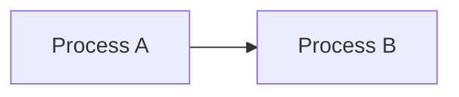

# noPromises: Classical Flow-Based Programming in Go

noPromises is a strict implementation of J. Paul Morrison's Flow-Based Programming (FBP) paradigm in Go. It leverages Go's channel-based concurrency and type system to create truly independent processes that communicate solely through message passing.

## Core Components

### 1. Server
```go
type Server struct {
    config    Config
    router    *mux.Router
    flows     *FlowManager
    processes *ProcessRegistry
    Handler   http.Handler
}
```
- RESTful API
- Flow management
- Process registry
- Middleware support
- Documentation server

### 2. Flow Management
```go
type FlowManager struct {
    flows map[string]*ManagedFlow
    mu    sync.RWMutex
}

type ManagedFlow struct {
    ID        string
    Config    map[string]interface{}
    State     FlowState
    StartTime *time.Time
    Error     string
}
```
- Flow lifecycle management
- State transitions
- Concurrent access
- Error handling

### 3. Process Registry
```go
type ProcessRegistry struct {
    processes map[string]ProcessFactory
    mu        sync.RWMutex
}

type ProcessFactory interface {
    Create(config map[string]interface{}) (Process, error)
}

type Process interface {
    Start(ctx context.Context) error
    Stop(ctx context.Context) error
}
```
- Process type registration
- Factory pattern
- Configuration validation
- Context-aware lifecycle

## Documentation

### Viewing Documentation
Once the server is running, documentation is available at:

```bash
# View documentation home
open http://localhost:8080/docs

# View API documentation
open http://localhost:8080/api-docs

# View network diagrams
open http://localhost:8080/diagrams/network/{flow-id}

# View live network updates
open http://localhost:8080/diagrams/network/{flow-id}/live
```

### Documentation Structure
```
docs/
├── api/              # API documentation
│   ├── endpoints.md  # API endpoint details
│   └── schemas.md    # JSON schemas
├── architecture/     # Architecture documentation
│   ├── core-concepts.md
│   └── subsystems/
│       ├── server.md
│       └── docs-server.md
├── guides/          # User guides
│   ├── getting-started.md
│   └── best-practices.md
└── README.md        # Documentation home
```

### Modifying Documentation
1. Documentation is written in Markdown
2. Files are served directly from the docs directory
3. Live updates for network diagrams
4. Mermaid diagram support

Example Markdown file:
```markdown
# Component Documentation

## Overview
Component description...

## Diagram

```

## API Endpoints

### Flow Management
- `POST /api/v1/flows` - Create flow
- `GET /api/v1/flows` - List flows
- `GET /api/v1/flows/{id}` - Get flow details
- `DELETE /api/v1/flows/{id}` - Delete flow
- `POST /api/v1/flows/{id}/start` - Start flow
- `POST /api/v1/flows/{id}/stop` - Stop flow
- `GET /api/v1/flows/{id}/status` - Get flow status

### Flow States
- `created`: Initial state after flow creation
- `starting`: Flow is in the process of starting
- `running`: Flow is actively running
- `stopping`: Flow is in the process of stopping
- `stopped`: Flow has been stopped
- `error`: Flow encountered an error

## Example Usage

### Creating a Flow
```http
POST /api/v1/flows
Content-Type: application/json

{
    "id": "example-flow",
    "nodes": {
        "reader": {
            "type": "FileReader",
            "config": {
                "filename": "input.txt"
            }
        }
    },
    "edges": []
}
```

### Starting a Flow
```http
POST /api/v1/flows/example-flow/start
```

### Getting Flow Status
```http
GET /api/v1/flows/example-flow/status

Response:
{
    "data": {
        "id": "example-flow",
        "state": "running",
        "started_at": "2024-01-01T12:00:00Z"
    }
}
```

## Current Status

### Implemented
- ✅ Basic server implementation
- ✅ Flow management
- ✅ Process registry
- ✅ RESTful API
- ✅ Flow lifecycle
- ✅ Error handling
- ✅ Concurrent operations
- ✅ Request validation
- ✅ Documentation server
- ✅ Network visualization

### Coming Soon
- 🚧 Core FBP components (IPs, Ports, Networks)
- 🚧 Process implementations
- 🚧 Monitoring system
- 🚧 Advanced error handling
- 🚧 Performance optimizations
- 🚧 Live documentation updates
- 🚧 WebSocket support

## Development Requirements
- Go 1.21+
- golangci-lint
- make

## Getting Started

1. Clone the repository
```bash
git clone https://github.com/elleshadow/noPromises
```

2. Install git hooks
```bash
make install-hooks
```

3. Run checks (linting and tests)
```bash
make check
```

4. Run tests with race detection
```bash
make test
```

5. Build the server
```bash
make server-build
```

6. Start the server with documentation
```bash
# Start on default port 8080
make server-start

# Or start on custom port with docs
make server-start-port-3000 DOCS_PATH=./docs
```

7. Stop the server
```bash
make server-stop
```

### Make Commands

| Command | Description |
|---------|-------------|
| `make all` | Run all checks and build |
| `make install-hooks` | Install git hooks |
| `make check` | Run linter, tests, and format check |
| `make lint` | Run golangci-lint |
| `make test` | Run tests with race detection |
| `make format-check` | Check code formatting |
| `make format` | Format code |
| `make build` | Build all binaries |
| `make server-build` | Build server binary |
| `make server-start` | Start server on port 8080 |
| `make server-start-port-X` | Start server on port X |
| `make server-stop` | Stop running server |
| `make clean` | Clean build artifacts and stop server |

## Contributing

See [CONTRIBUTING.md](docs/CONTRIBUTING.md) for guidelines.

## License

MIT License - See [LICENSE](LICENSE) for details

