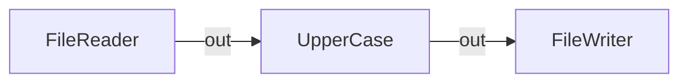
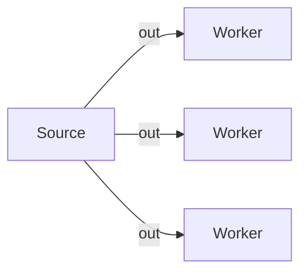
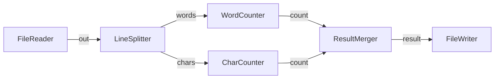
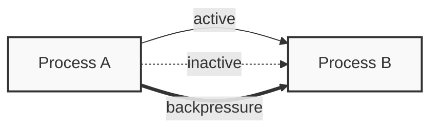

# Network Visualization

This document details how networks are visualized using Mermaid diagrams.

## Mermaid Generation

### Network to Mermaid Conversion
```go
type MermaidGenerator struct {
    networks map[string]*Network
}

func (g *MermaidGenerator) GenerateFlowDiagram(networkID string) (string, error) {
    network, exists := g.networks[networkID]
    if !exists {
        return "", ErrNetworkNotFound
    }

    var diagram strings.Builder
    diagram.WriteString("graph LR\n")

    // Add nodes
    for id, process := range network.Processes() {
        diagram.WriteString(fmt.Sprintf("    %s[%s]\n", id, process.Type()))
    }

    // Add connections
    for _, edge := range network.Connections() {
        diagram.WriteString(fmt.Sprintf("    %s -->|%s| %s\n", 
            edge.FromNode, edge.FromPort, edge.ToNode))
    }

    return diagram.String(), nil
}
```

## Example Diagrams

### Simple Pipeline


### Fan-Out Pattern


### Complex Network


## API Endpoints

### Get Network Diagram
```http
GET /api/flows/{id}/diagram

Response:
{
    "diagram": "graph LR\n    reader[FileReader]\n    writer[FileWriter]\n    reader -->|out| writer"
}
```

### Get Network Status Diagram
```http
GET /api/flows/{id}/status-diagram

Response:
{
    "diagram": "graph LR\n    reader[FileReader]:::running\n    writer[FileWriter]:::error\n    reader -->|out| writer\n    classDef running fill:#green\n    classDef error fill:#red"
}
```

## Live Updates

### WebSocket Updates
```javascript
const ws = new WebSocket('ws://localhost:8080/api/flows/{id}/diagram/live')
ws.onmessage = (event) => {
    const diagram = JSON.parse(event.data).diagram
    // Update diagram display
}
```

## Style Customization

### Process States
```css
classDef default fill:#f9f9f9,stroke:#333,stroke-width:2px;
classDef running fill:#d4edda,stroke:#28a745;
classDef error fill:#f8d7da,stroke:#dc3545;
classDef waiting fill:#fff3cd,stroke:#ffc107;
```

### Connection States
