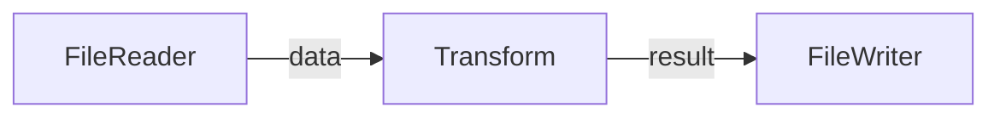

# Network Visualization

This document details how networks are visualized using Mermaid diagrams.

## Core Components

### MermaidGenerator
```go
type MermaidGenerator struct {
    networks map[string]interface{}
}

func NewMermaidGenerator() *MermaidGenerator {
    return &MermaidGenerator{
        networks: make(map[string]interface{}),
    }
}
```

## Diagram Generation

### Network to Diagram Conversion
```go
func (g *MermaidGenerator) GenerateFlowDiagram(networkID string) (string, error) {
    network, exists := g.networks[networkID]
    if !exists {
        return "", fmt.Errorf("network not found: %s", networkID)
    }

    var diagram strings.Builder
    diagram.WriteString("graph LR\n")

    // Add nodes with status
    if nodes, ok := netMap["nodes"].(map[string]interface{}); ok {
        for id, node := range nodes {
            nodeMap := node.(map[string]interface{})
            nodeType := nodeMap["type"].(string)
            status := nodeMap["status"].(string)
            diagram.WriteString(fmt.Sprintf("    %s[%s]:::%s\n", 
                id, nodeType, status))
        }
    }

    // Add edges with ports
    if edges, ok := netMap["edges"].([]interface{}); ok {
        for _, edge := range edges {
            edgeMap := edge.(map[string]interface{})
            from := edgeMap["from"].(string)
            to := edgeMap["to"].(string)
            port := edgeMap["port"].(string)
            diagram.WriteString(fmt.Sprintf("    %s -->|%s| %s\n", 
                from, port, to))
        }
    }

    return diagram.String(), nil
}
```

## Style Definitions

### Node States
```css
classDef running fill:#d4edda,stroke:#28a745;
classDef waiting fill:#fff3cd,stroke:#ffc107;
classDef error fill:#f8d7da,stroke:#dc3545;
```

### Example Output


## API Integration

### Static Diagram Endpoint
```http
GET /diagrams/network/{id}

Response:
{
    "diagram": "graph LR\n    reader[FileReader]:::running\n..."
}
```

### Live Updates Endpoint
```http
GET /diagrams/network/{id}/live

# WebSocket connection for real-time updates
```

## Network Updates

### State Changes
```go
// Update network state
g.SetNetwork(id, map[string]interface{}{
    "nodes": map[string]interface{}{
        "reader": map[string]interface{}{
            "type": "FileReader",
            "status": "running",
        },
    },
})
```

### Live Diagram Updates
```javascript
const ws = new WebSocket(`ws://${host}/diagrams/network/${id}/live`)
ws.onmessage = (event) => {
    const data = JSON.parse(event.data)
    updateDiagram(data.diagram)
}
```

## Best Practices

### Node Representation
- Use descriptive node labels
- Include node type information
- Show current status
- Maintain consistent styling

### Edge Representation
- Label all connections
- Show port names
- Indicate data flow direction
- Use consistent line styles

### Status Indication
- Running: Green
- Waiting: Yellow
- Error: Red
- Inactive: Gray

### Layout Guidelines
- Left to right flow
- Minimize edge crossings
- Group related nodes
- Maintain spacing